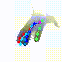
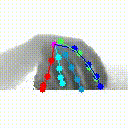

This project corresponds to SRN: Stacked Regression Network for Real-time 3D Hand Pose Estimation, which is accepted in BMVC 2019.

# Realtime demo
## normal hand  

## small hand
&nbsp;&nbsp;&nbsp;&nbsp;&nbsp;&nbsp;&nbsp;&nbsp;

\* Demos above are realtime results from Kinect V2 using models trained on [Hands17](http://icvl.ee.ic.ac.uk/hands17/challenge/) dataset (Intel Realsense SR300).  
# Usage 

# Comparison with state-of-the-art methods
## NYU

## ICVL

## MSRA

## HANDS17

